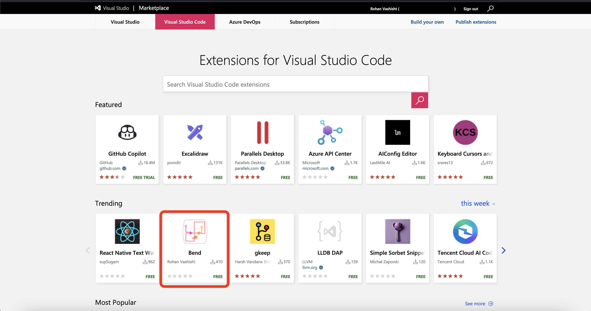

## 👋 Hello there!

# I am Rohan Vashisht, an 18 year old boy, who loves to code.

## Here are some of my contributions in different open source projects:

- A complete vscode extension for the Bend programming language which went trending at #2 on vscode market place:
https://marketplace.visualstudio.com/items?itemName=RohanVashisht.bend

## Contributions to carbon programming language:
- I have made a vscode extension for the carbon programming language named carbonizer https://github.com/carbon-language/carbon-lang/pull/3953
- I have also contributed a vscode extension to the Carbon programming language's main repo in this pull request: https://github.com/carbon-language/carbon-lang/pull/3953

## Lite-xl IDE contributions:
- Syntax highlighting support for Buzz programming language.
- Syntax highlighting support for Bazel programming language.
- Syntax highlighting support for Carbon programming language.
- Syntax highlighting support for Brainfuck programming language.
- Syntax highlighting support for Clojure programming language.
- Syntax highlighting support for Fortran programming language.
- Syntax highlighting support for Swift programming language.
- Syntax highlighting support for Bend programming language.
- Autosave on init.lua bug fix.
- Lsp contribution for Clojure programming language.
- litexp theme
- mobilephone theme
- hackers-den theme

### Lite-xl website contributions:
- A website to browse various themes made using nextjs and tailwind https://litexlthemes.vercel.app/
- A website to browse plugins made in pure preact https://litexlplugins.vercel.app/
- A web application to create custom themes using lite-xl: https://rohanvashisht1234.github.io/makelitexltheme/

## My own projects:
- A rust based backend framework named [Rohanasan](https://github.com/rohanasan/rohanasan-rs) which can handle 52142.29 request within 1 second, was initially made in C then moved on to rust.
- A rust, python, Vlang based alternative for html named [rohanasantml](https://github.com/rohanasan/rohanasantml)
- A lot of other project which you can view [here](https://github.com/RohanVashisht1234?tab=repositories).

